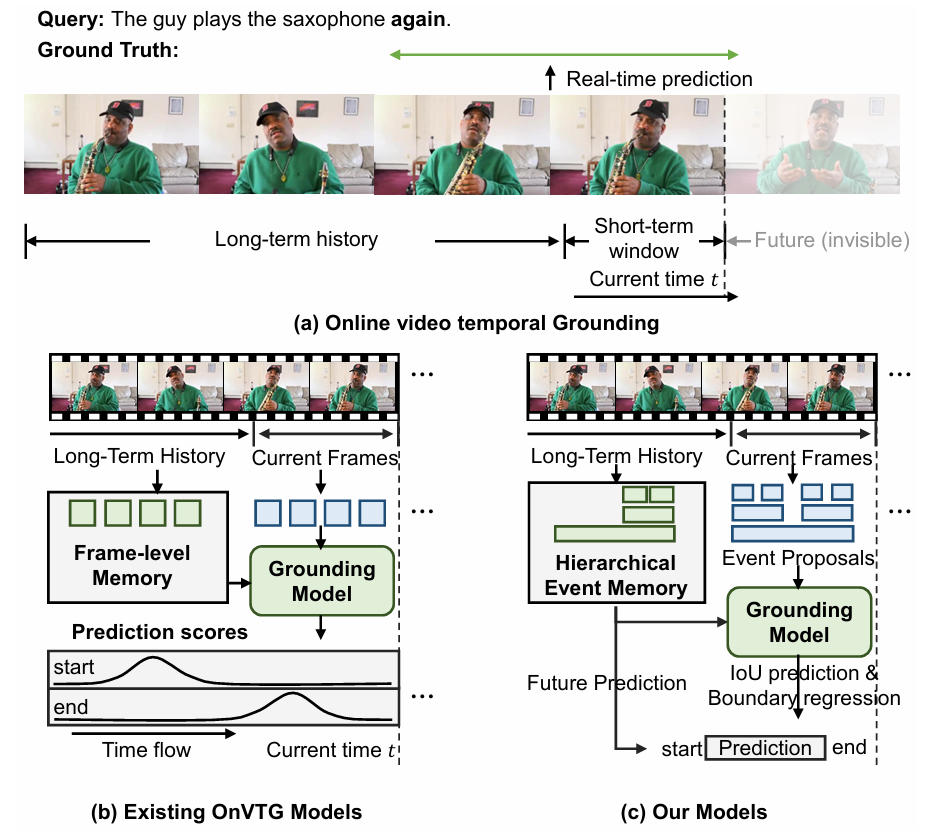

# Hierarchical Event Memory for Accurate and Low-latency Online Video Temporal Grounding

In this work, we propose hierarchical event memory for online video temporal grounding (OnVTG), which requires the model to locate events related to a given natural language query within a video stream. Unlike regular video temporal grounding, OnVTG requires the model to make predictions without observing future frames. We achieve efficient, accurate, and real-time online video temporal localization. We validate the effectiveness of our method on the ActivityNet Captions, TACoS, and MAD datasets.

Our paper is accepted by ICCV-2025.



# Requiments

Please install the necessary dependencies listed in [`requirements.txt`](requirements.txt).

# Data Preparation

Download the data for ActivityNet Captions and TACoS datasets from [Google Drive](https://drive.google.com/drive/folders/1XduVkamXuHl_fosOhxeiM4M2eFdeVon4?usp=sharing) or [Baidu Netdisk](https://pan.baidu.com/s/1XYbh36lWErWbkQW_n-fQQg?pwd=wefg). Please download the data for MAD dataset from the [official repository](https://github.com/Soldelli/MAD).

Please decompress the data and place it in the `data` directory.

# Training and Inference

# ActivityNet Captions

To train the model on the ActivityNet Captions dataset:

```bash
CUDA_VISIBLE_DEVICES=0 bash scripts/train.sh configs/anet.yaml
```

You can download the trained model checkpoint from [Google Drive](https://drive.google.com/drive/folders/1XZ9VyZRJ0IQ6nWnULaPf7jqcPHtae_kw?usp=sharing) or [Baidu Netdisk](https://pan.baidu.com/s/1U8fvou4Avjxpk2eMjiR7HA?pwd=g2v7).

To evaluate the trained model:

```bash
# Inference using single GPU
CUDA_VISIBLE_DEVICES=0 bash scripts/eval.sh configs/anet.yaml results/anet/models/best.pth
# Inference using multiple GPUs
CUDA_VISIBLE_DEVICES=0,1,2,3 bash scripts/eval.sh configs/anet.yaml results/anet/models/best.pth
```

You can replace `results/anet/models/best.pth` with the downloaded checkpoint.

The results should be:

| Method                    | $R_{0.5}^1$ | $R_{0.7}^1$ | $R_{0.5}^5$ | $R_{0.7}^5$ | SD       | ED       |
|---------------------------|-------------|-------------|-------------|-------------|----------|----------|
| With Future Prediction    | 42.89       | 24.49       | 67.82       | 51.74       | -1.58s   | -10.96s   |
| Without Future Prediction | 45.29       | 26.25       | 76.24       | 62.14       | 41.10s   | -10.89s   |

# MAD

To train the model on the MAD dataset:

```bash
CUDA_VISIBLE_DEVICES=0,1,2,3 bash scripts/train.sh configs/mad.yaml
```

If you wish to train using a different number of GPUs, please modify the `batch_size` in `configs/mad.yaml` to ensure that the `batch_size` multiplied by the number of GPUs remains unchanged.

You can download the trained model checkpoint from [Google Drive](https://drive.google.com/drive/folders/1XZ9VyZRJ0IQ6nWnULaPf7jqcPHtae_kw?usp=sharing) or [Baidu Netdisk](https://pan.baidu.com/s/1U8fvou4Avjxpk2eMjiR7HA?pwd=g2v7).

To evaluate the trained model:

```bash
# Inference using single GPU
CUDA_VISIBLE_DEVICES=0 bash scripts/eval.sh configs/mad.yaml results/mad/models/best.pth
# Inference using multiple GPUs
CUDA_VISIBLE_DEVICES=0,1,2,3 bash scripts/eval.sh configs/mad.yaml results/mad/models/best.pth
```

Please replace `results/mad/models/best.pth` with the downloaded checkpoint.

The results should be:

| Method                    | $R_{0.3}^5$ | $R_{0.5}^5$ | $R_{0.3}^{50}$ | $R_{0.5}^{50}$ | SD       | ED       |
|---------------------------|-------------|-------------|----------------|----------------|----------|----------|
| With Future Prediction    | 9.84        | 6.43        | 16.67          | 12.18          | 0.64s   | -1.10s   |
| Without Future Prediction | 15.76       | 11.07       | 37.84          | 29.21          | 3.60s   | -1.45s   |

# TACoS

To train the model on the TACoS dataset:

```bash
CUDA_VISIBLE_DEVICES=0 bash scripts/train.sh configs/tacos.yaml
```

You can download the trained model checkpoint from [Google Drive](https://drive.google.com/drive/folders/1XZ9VyZRJ0IQ6nWnULaPf7jqcPHtae_kw?usp=sharing) or [Baidu Netdisk](https://pan.baidu.com/s/1U8fvou4Avjxpk2eMjiR7HA?pwd=g2v7).

To evaluate the trained model:

```bash
# Inference using single GPU
CUDA_VISIBLE_DEVICES=0 bash scripts/eval.sh configs/tacos.yaml results/tacos/models/best.pth
# Inference using multiple GPUs
CUDA_VISIBLE_DEVICES=0,1,2,3 bash scripts/eval.sh configs/tacos.yaml results/tacos/models/best.pth
```

Please replace `results/tacos/models/best.pth` with the downloaded checkpoint.

The results should be:

| Method                    | $R_{0.5}^1$ | $R_{0.7}^1$ | $R_{0.5}^5$ | $R_{0.7}^5$ | SD       | ED       |
|---------------------------|-------------|-------------|-------------|-------------|----------|----------|
| With Future Prediction    | 37.44       | 27.32       | 57.49       | 44.44       | -1.28s   | -3.78s   |
| Without Future Prediction | 44.19       | 30.87       | 68.96       | 52.69       | 22.38s   | -4.26s   |

# Citation

```
@inproceedings{zheng-etal-2025-hierarchical,
    title = "Hierarchical Event Memory for Accurate and Low-latency Online Video Temporal Grounding",
    author = "Zheng, Minghang  and
      Peng, Yuxin  and
      Sun, Benyuan and
      Yang, Yi and
      Liu, Yang",
    booktitle = "Proceedings of the IEEE/CVF International Conference on Computer Vision (ICCV)",
    year = "2025"
}
```